# 🎶 Harmony Hub

**Harmony Hub** is a feature-rich, modern music streaming and management application built entirely with **Jetpack Compose**. It provides a seamless and beautiful music experience, combining online streaming with powerful local library management.

<p align="center">
  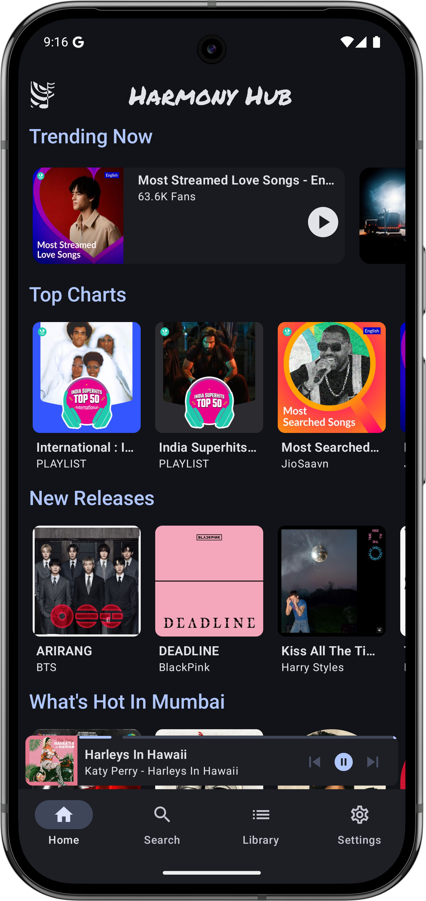
  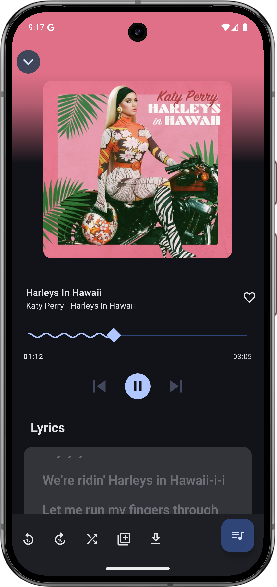
  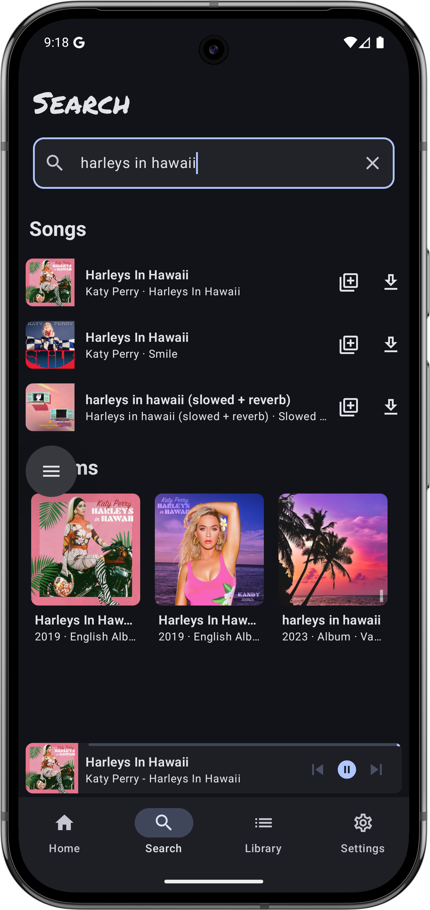
</p>

---

## ✨ Key Features

*   **Music Streaming & Discovery**: Search and stream a vast library of songs, albums, and artists.
*   **Modern Music Player**: High-performance player with **Media3 (ExoPlayer)** integration, featuring fluid animations and high-fidelity playback.
*   **Personalized Library**: Manage "Liked" songs, create custom playlists, and organize your music.
*   **Artist & Album Exploration**: Deep dive into artist profiles and explore full discographies.
*   **Offline Support**: Download your favorite tracks for offline listening.
*   **Smart Search**: Quickly find what you're looking for with an integrated, responsive search system.
*   **In-App Updates**: Stay up to date with the latest features and improvements with an integrated update system.
*   **Modern UI/UX**: Stunning **Material 3** interface with dynamic theming and smooth transitions.

---

## 📸 Screenshots

| Home | Search | Library |
| :---: | :---: | :---: |
|  |  | 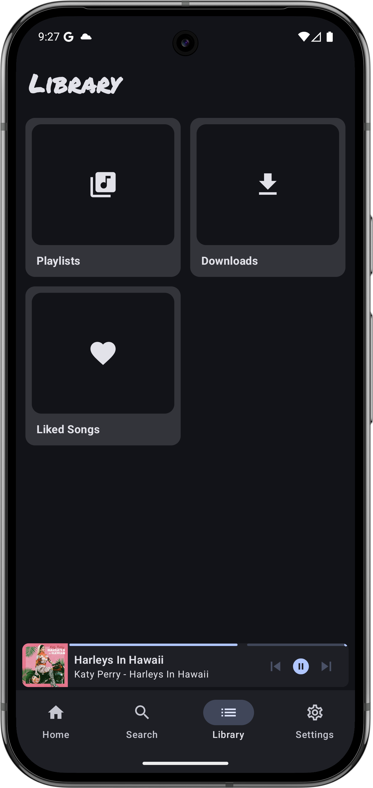 |

| Music Player | Artist | Album |
| :---: | :---: | :---: |
|  | 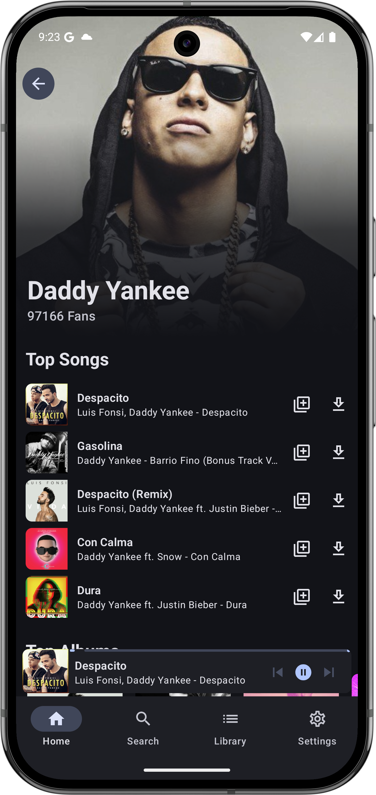 | 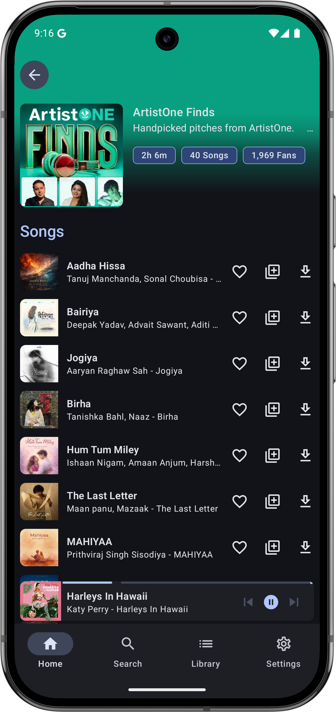 |

| Updates | Downloaded Songs | Playlist |
| :---: | :---: | :---: |
| 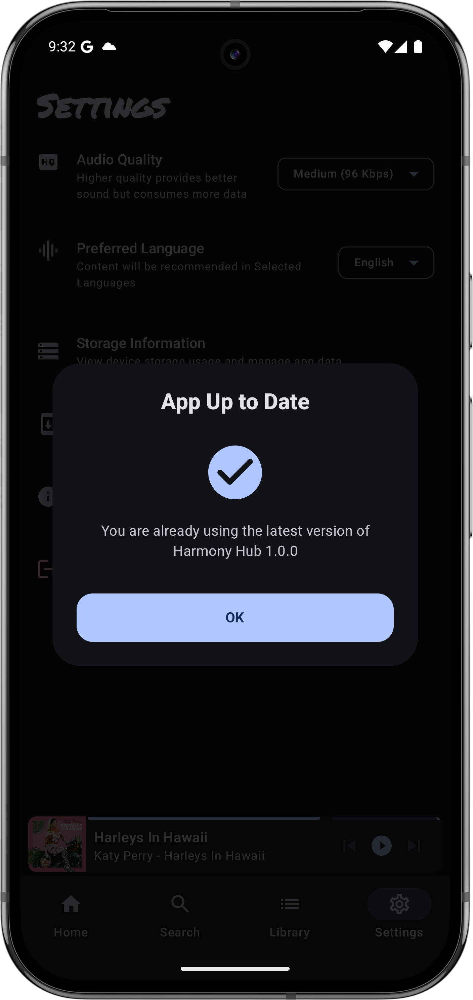 | 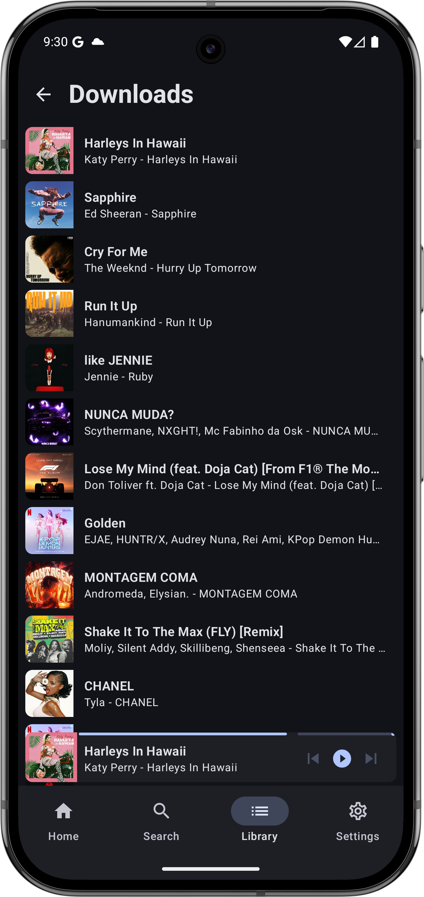 | 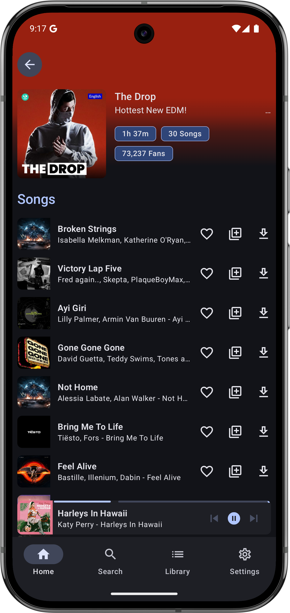 |

| Settings | Local Playlist | Storage Details |
| :---: | :---: | :---: |
| 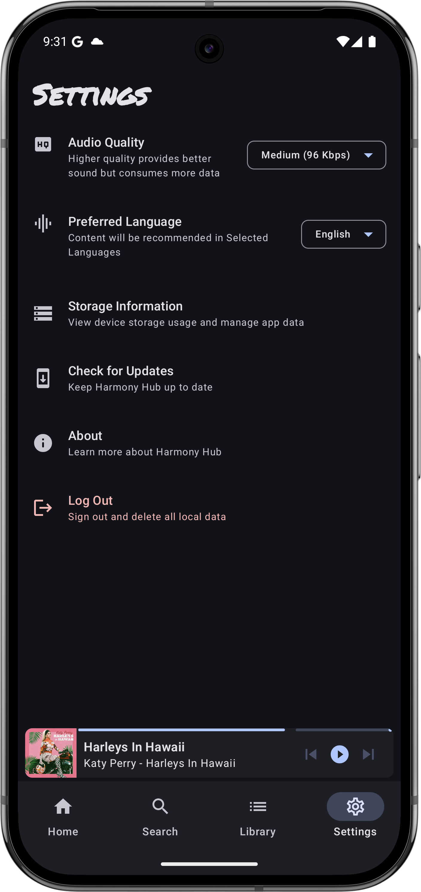 | 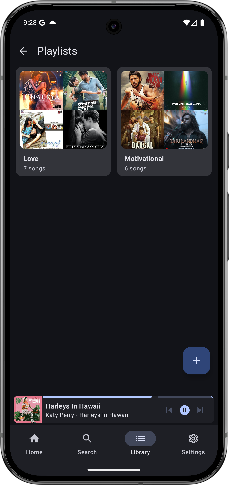 | 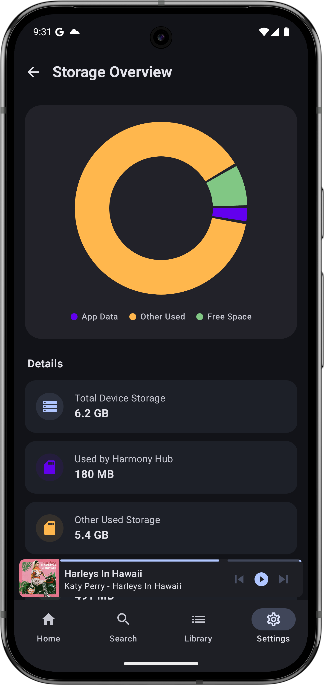 |

---

## 🛠️ Technical Highlights

*   **UI Framework**: Built with **Jetpack Compose** for a modern, declarative UI.
*   **Media Engine**: Powered by **Android Media3 (ExoPlayer)** for robust audio playback.
*   **Local Storage**: Uses **Room Database** for efficient caching and local data persistence.
*   **Networking**: **Retrofit** and **OkHttp** for optimized API communication.
*   **Image Loading**: High-performance image loading with **Coil**.
*   **Architecture**: Follows clean architecture principles with a focus on modularity and testability.

---

## 📦 Getting Started

### Prerequisites
*   Android 7.0+ (API level 24+)
*   Android Studio Ladybug or later

### Installation
1.  Clone the repository:
    ```bash
    git clone https://github.com/yourusername/Harmony_Hub_Compose.git
    ```
2.  Open the project in **Android Studio**.
3.  Build and run the app on your device or emulator.

---

## 🤝 Contributing
Contributions are welcome! Feel free to open issues or submit pull requests to help improve Harmony Hub.

---
**Harmony Hub** — *Harmonizing your music experience.* 🎶✨
